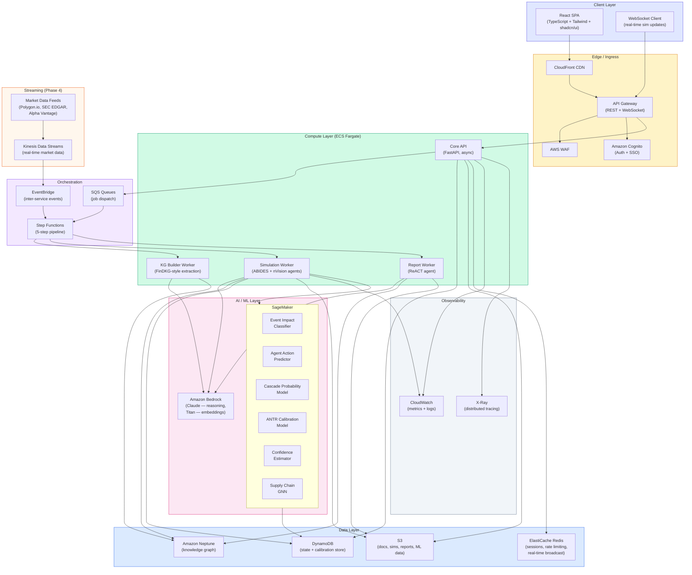
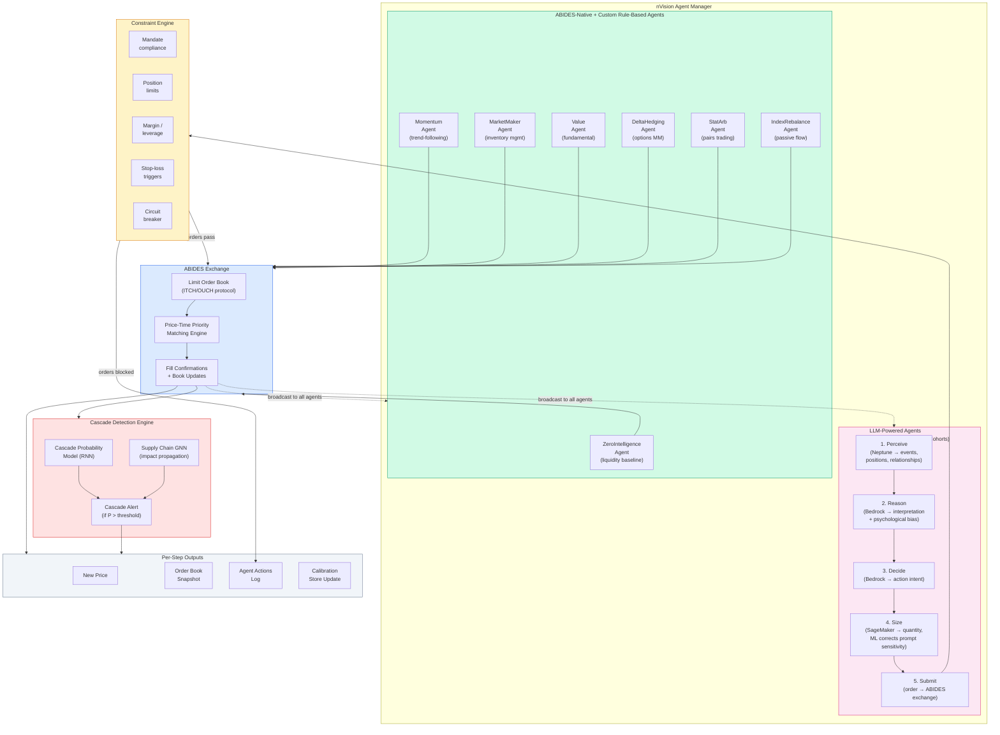
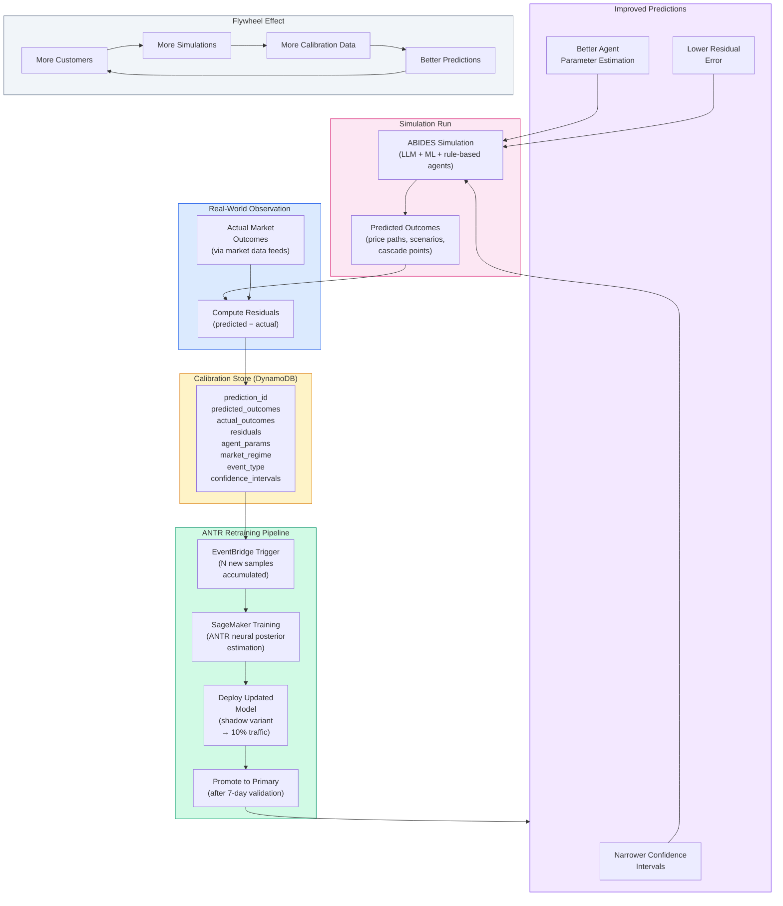
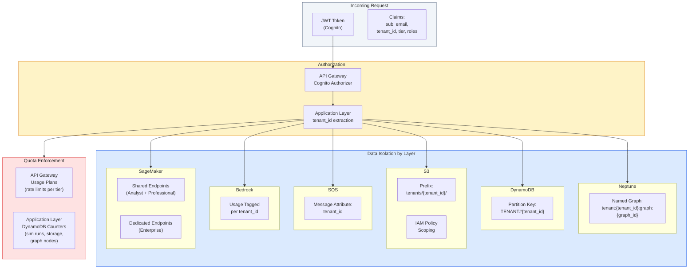
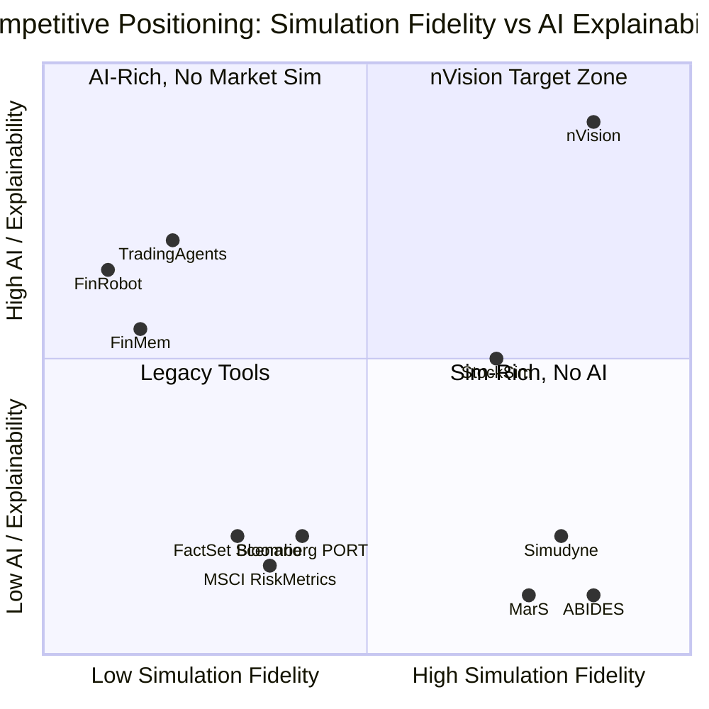

# nVision — Architecture Diagrams

Visual architecture diagrams for the nVision platform. Renders natively on GitHub/Bitbucket via Mermaid.

**Companion docs:**
- [PRODUCTIZATION.md](./PRODUCTIZATION.md) — business strategy, pricing, GTM
- [TECHNICAL-ARCHITECTURE.md](./TECHNICAL-ARCHITECTURE.md) — detailed technical spec

---

## 1. High-Level System Architecture

The full target-state platform with ABIDES matching engine, Neptune knowledge graph, Bedrock LLM orchestration, and SageMaker ML models.

---

## 2. Simulation Engine Detail (ABIDES-based)

The core simulation architecture showing how LLM agents, ABIDES-native agents, and the constraint/cascade engines interact through the ABIDES exchange.

---

## 3. Five-Step Pipeline Flow

The end-to-end pipeline from document upload to interactive exploration, orchestrated by Step Functions.

```mermaid
graph LR
    subgraph Step1["Step 1: Event Ingestion<br/>& Graph Build"]
        DOC["Documents<br/>(10-Ks, transcripts,<br/>news, scenarios)"]
        EXTRACT["FinDKG-Style<br/>Extraction<br/>(Bedrock + reflection<br/>agent validation)"]
        KG["Financial<br/>Knowledge Graph<br/>(Neptune)"]
        EIC2["Event Impact<br/>Classifier<br/>(SageMaker)"]
    end

    subgraph Step2["Step 2: Agent Generation<br/>& Environment Setup"]
        ENTITIES["Read Entities<br/>from KG"]
        RANK["Entity Importance<br/>Ranker<br/>(PageRank)"]
        PERSONA["LLM Persona<br/>Generation<br/>(Bedrock)"]
        CONFIG["Sim Config<br/>Auto-generation"]
        SPLIT{{"Top-N → LLM agents<br/>Rest → ABIDES-native"}}
    end

    subgraph Step3["Step 3: Market<br/>Simulation"]
        SIM["ABIDES Exchange<br/>+ LLM Agents<br/>+ Rule-Based Agents"]
        CONSTRAIN["Constraint Engine<br/>(margin, stops,<br/>circuit breakers)"]
        CASCADE["Cascade Detection<br/>(RNN + GNN)"]
        EVOLVE["Graph Evolves<br/>(positions shift,<br/>relationships emerge)"]
    end

    subgraph Step4["Step 4: Report<br/>Generation"]
        REACT["ReACT Agent<br/>(Bedrock)"]
        RETRIEVE["Retrieval Tools<br/>(InsightForge,<br/>PanoramaSearch,<br/>QuickSearch)"]
        SCENARIOS["Scenario-Weighted<br/>Predictions"]
        CI["Conformal Prediction<br/>Confidence Intervals"]
    end

    subgraph Step5["Step 5: Interactive<br/>Exploration"]
        CHAT["Chat with<br/>Report Agent"]
        INTERVIEW["Interview<br/>Individual Agents<br/>(killer feature)"]
        WHATIF["What-If<br/>Variations"]
        COMPARE["Scenario<br/>Comparison"]
    end

    DOC --> EXTRACT --> KG
    DOC --> EIC2
    KG --> ENTITIES --> RANK --> SPLIT
    SPLIT --> PERSONA --> CONFIG

    CONFIG --> SIM
    SIM --> CONSTRAIN --> CASCADE --> EVOLVE
    EVOLVE -.->|"updated graph"| KG

    EVOLVE --> REACT
    REACT --> RETRIEVE --> SCENARIOS --> CI

    CI --> CHAT
    CI --> INTERVIEW
    CI --> WHATIF
    CI --> COMPARE

    style Step1 fill:#dbeafe,stroke:#2563eb
    style Step2 fill:#d1fae5,stroke:#059669
    style Step3 fill:#fce7f3,stroke:#db2777
    style Step4 fill:#f3e8ff,stroke:#7c3aed
    style Step5 fill:#fef3c7,stroke:#d97706
```

---

## 4. Calibration Feedback Loop (ANTR Pipeline)

The continuous calibration system that makes every simulation run improve the next one.

---

## 5. Knowledge Graph Construction (FinDKG-Style)

The multi-pass extraction pipeline from documents to temporal financial knowledge graph.

```mermaid
graph LR
    subgraph Sources["Document Sources"]
        PDF["10-K / 10-Q<br/>Filings"]
        EARN["Earnings<br/>Transcripts"]
        NEWS["News<br/>Articles"]
        EXEC["Executive<br/>Orders"]
        FREE["Free-Text<br/>Scenario"]
    end

    subgraph Parse["Document Processing"]
        CHUNK["Intelligent Chunking<br/>(table-aware, section-aware)"]
        EMBED["Titan Embeddings<br/>(for retrieval)"]
    end

    subgraph Extract["Entity Extraction (Bedrock)"]
        PASS1["Pass 1: Initial Extraction<br/>(Claude → entity/relationship<br/>triples using financial<br/>ontology schema)"]
        PASS2["Pass 2: Reflection Agent<br/>(validates extractions,<br/>catches errors,<br/>resolves conflicts)"]
        PASS3["Pass 3: Cross-Document<br/>Entity Resolution<br/>(merge duplicates,<br/>link co-references)"]
    end

    subgraph Ontology["Financial Ontology"]
        ENT["Entity Types:<br/>Company, InstitutionalInvestor,<br/>RetailCohort, AlgorithmicStrategy,<br/>MarketMaker, CentralBank,<br/>Regulator, Event"]
        REL["Relationship Types:<br/>SUPPLIES, COMPETES_WITH,<br/>HOLDS_POSITION, CREDIT_EXPOSURE,<br/>TRACKS, REGULATES,<br/>POLICY_SENSITIVITY,<br/>CORRELATES_WITH, TRIGGERED_BY"]
    end

    subgraph Graph["Neptune Knowledge Graph"]
        WRITE["Write to Neptune<br/>(Gremlin)"]
        TEMPORAL["Temporal Properties<br/>(valid_from / valid_to<br/>on every entity + edge)"]
        NAMED["Tenant-Scoped<br/>Named Graphs"]
    end

    subgraph Enrich["ML Enrichment"]
        RANK2["Entity Importance<br/>Ranker (PageRank)"]
        REGIME["Correlation Regime<br/>Detector (HMM)"]
        IMPACT["Event Impact<br/>Classifier (XGBoost)"]
    end

    Sources --> CHUNK --> EMBED
    CHUNK --> PASS1
    Ontology -.->|"schema"| PASS1
    PASS1 --> PASS2 --> PASS3

    PASS3 --> WRITE --> TEMPORAL --> NAMED

    NAMED --> RANK2
    NAMED --> REGIME
    NAMED --> IMPACT

    style Sources fill:#f1f5f9,stroke:#64748b
    style Parse fill:#dbeafe,stroke:#2563eb
    style Extract fill:#fce7f3,stroke:#db2777
    style Ontology fill:#fef3c7,stroke:#d97706
    style Graph fill:#d1fae5,stroke:#059669
    style Enrich fill:#f3e8ff,stroke:#7c3aed
```

---

## 6. Multi-Tenant Data Isolation

How tenant data is isolated across every layer of the stack.

---

## 7. Competitive Positioning Map

Where nVision sits relative to existing tools across two axes: simulation fidelity and AI/explainability.

---

*Last updated: 2026-03-15*
*Diagrams render via Mermaid — view on GitHub or use a Mermaid-compatible viewer*
